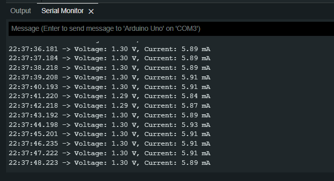

# Phototransistor Effect Verifictation Using LED & Arduino

##  Introduction:

 

## So what is Phototransistor ? 
 

### A phototransistor is a semiconductor device that converts light into an electrical current. It consists of a p-type transistor with its base electrode doped to allow current. (also known as a light-sensitive resistor or light-dependent resistor) is an electrically controlled resistor that changes its resistance in response to incident light 

 

## Material Required

<ul>
<li>Arduino UNO R3</li>
<li> Breadboard </li>
<li>LED</li>
<li>Wires</li>

</ul>

## Experiment:-

### In this Experiment We use an LED to understand  how an  Phototrasistor work . And due to lack of Equipment like Multimeter we use Arduino UNO R3 & program it to use it as a Voltmeter & ammeter, to Measure the Volt & current acroos the LED when a Light fall into the LED. 

[ Check the Arduino  code Here ](./code.ino)

### We connect the  anode side of the LED in the Digital PIN .no of 13 of the  Arduino and cathode side to Ground. 
 

### Make sure to hold you Phone Torch above the LED Properly 
 

### Then We get the output in the Serial Monitor of Arduino IDE, the Voltage & current measured when incident light fall on the LED is displayed over in Serial Monitor.

### the varitation are over here in Voltage & current by changing the Density (Brightness) of the incident light(in this case Phone Torch)  to test & make sure that the correct voltage & current is displayed. Also to check the voltage & Current on diffrent density of light.

